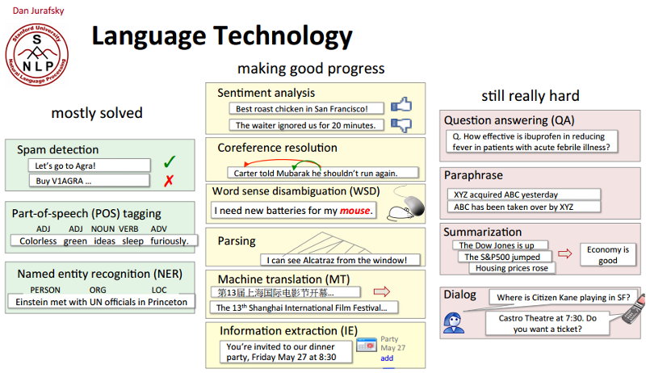
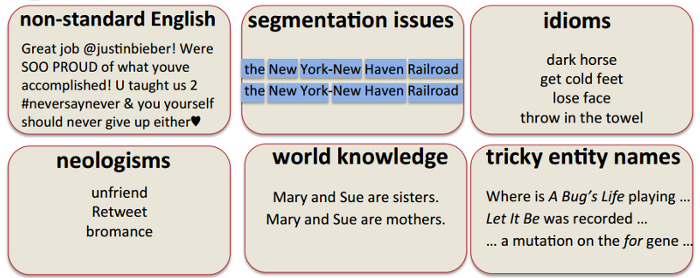

 

# Referencias

- *Intro to NLP*.[^intro-nlp]

- *What is Computational Linguistics?*[^what]

- *Perspectives in Computational Linguistics*.[^perspective]

- *The Stupidity of Computers*.[^stupidity]

- *An Inside Update on NLP*.[^update-nlp]

# ¿Qué es el PLN?

El Procesamiento del Lenguaje Natural (PLN)\footnote{En inglés, \textit{Natural Language Processing} (NLP) o mejor \#NLProc. La disciplina recibe otros nombres, como \textit{Human Language Technologies} (HLT), tecnologías de la lengua, ingeniería lingüística, lingüística computacional, etc.} es el estudio científico del lenguaje desde un punto de vista computacional. 

Es un área claramente multidisciplinar que aglutina lingüística, ingeniería, inteligencia artificial, informática, estadística, psicología, interacción hombre-máquina, ciencias ognitivas, etc.

Nace como disciplina en los años 1950s con un objetivo inicial claro: construir sistemas de traducción automática.

## Objetivos 

El PLN se interesa en proporcionar modelos computacionales para describir, modelar o reproducir distintos fenómenos lingüísticos. Tiene como principal objetivo el desarrollo de herramientas y soluciones que permitan:

- procesar automáticamente lenguaje natural.

- comprender el lenguaje natural.

- interaccionar de manera eficaz con ordenadores (o máquinas) de manera natural a través del habla.

## Enfoques

Tradicionalmente, el PLN ha trabajado utilizando dos aproximaciones diferentes:

1. sistemas basados en conocimiento: en problemas que podemos modelar, proporcionamos conocimiento lingüístico formalizado y las máquinas actúan aplicando reglas.

2. sistemas basados en estadística: en problemas que son costosos o no podemos modelar, proporcionamos ingentes cantidades de datos (colecciones de documentos) y dejamos que la máquina cree el modelo a partir del cálculo de probabilidades y la detección de patrones de uso.

## Progresos

La disciplina nace a partir de los 1950s y al inicio de la Guerra Fría con el objetivo principal de construir sistemas de **traducción automática**.

En la decada siguiente aparecen los llamados **sistemas expertos** que asistían en la toma de decisiones: sistemas de diálogo que trataban de imitar conversaciones humanas, creación de ontologías para capturar conocimiento del mundo.

Hasta los 1980s, la mayor parte de los sistemas de PLN estaban basados en conocimiento y manejaban complejas reglas diseñadas a mano. Se deja sentir la influencia de la Lingüística Generativa de Noam Chomsky.

A partir de esa década, irrumplen las aproximaciones estadísticas basadas en sistemas de **aprendizaje automático**, que requieren grandes colecciones de datos anotados manualmente. Este desarrollo discurre paralelo al aumento de potencia de los ordenadores.

Actualmente, vivimos un auge de los sistemas de aprendizaje automático *supervisados* (anotados manualemente) y *no supervisados* (sin anotaciones de ningún tipo), con especial énfasis en el uso de la Web. Se aprovecha la explosión de datos disponibles en formato electrónico.

En la década de los 2010s hemos visto el resurgir de los sistemas de aprendizaje automático que utilizan **redes neuronales** para procesar ingentes cantidades de datos (*deep learning*).

## Tareas típicas del PLN

Una buena manera de conocer los temas que trata un área de investigación es revisar el calendario de los congresos más importantes:[^calendar]
  
- ACL 2016: *call for papers*[^acl-cfp] y programa[^acl-cfp].

- EMNLP 2016: *call for papers*[^emnlp-cfp] y programa[^emnlp].

- COLING 2016: *call for papers*[^coling-cfp] y programa[^coling]

- SEPLN 2016: *call for papers*[^sepln-cfp]y programa[^sepln]

De este modo, podemos identificar algunas de las tareas más comunes del área:

- Desambiguación semántica (*word sense disambiguation*) y reconocimiento de entidades (*named entities recognition*).

- Análisis morfo-sintáctico (*[PoS tagging](http://nbviewer.ipython.org/gist/vitojph/5465948)/[parsing](http://nbviewer.ipython.org/gist/vitojph/5524353)*)

- Traducción automática (*machine translation*): [Google Translate](http://translate.google.es)

- Extracción de información (*information extraction*): [TripIt](https://www.tripit.com/) y los [bundles de Inbox](https://support.google.com/inbox/answer/6228360?hl=en)

- Reconocimiento del habla (*automatic speech reconition*) y síntesis de voz (*speech synthesis*): [Google Voice Search](http://www.google.com/insidesearch/features/voicesearch/index-chrome.html)

- Recuperación de información (*information retrieval*): [Google Search](https://support.google.com/websearch/answer/134479?hl=en&ref_topic=3081620),
  [Bing](http://www.bing.com) y [Wolfram|Alpha](https://www.wolframalpha.com/examples/)

- Resumen automático (*automatic summarization*) y generación automática de textos: [Quakebot](http://www.latimes.com/local/earthquakes/) y [Automated Insights](http://automatedinsights.com/)

- Búsqueda de respuestas (*question answering*): tímidos intentos de [Google](https://www.google.es/?gfe_rd=cr&ei=MMHyV_uRNO2gzAbS7ITIDw#q=cu%C3%A1nto+mide+torre+picasso) o [Bing](https://www.bing.com/search?q=d%c3%b3nde+est%c3%a1+pamplona&qs=HS&pq=d%c3%b3nde+es&sc=8-8&sp=1&cvid=551C10183EB545CA92783A664393826F&FORM=QBRE) y, sbre todo, [Watson](http://www.youtube.com/watch?v=WFR3lOm_xhE)

- Análisis de opiniones (*sentiment analysis*): [Bitext](https://blog.bitext.com/) y [Atribus](http://www.atribus.com)

- Comprensión del lenguaje natural (*natural language understanding*): [Siri](https://www.apple.com/ios/siri/), [Google Now](https://www.google.com/search/about/learn-more/now/) y [Cortana](https://support.microsoft.com/en-us/help/17214/windows-10-what-is)

## Problemas resueltos y cuestiones abiertas

# ¿Por qué es tan difícil el PLN?

El lenguaje natural es eminentemente **ambiguo**. Esta es la principal diferencia entre lenguas naturales y lenguajes artificiales.
  
Esta ambigüedad existe a varios niveles:

- ambigüedad fonética y fonológica: *vaca/baca*, *casa/caza*, *has sido tú/has ido tú*

- ambigüedad morfológica: *casa, beso, río, bajo*

- ambigüedad sintáctica: *Ayer me encontré a tu padre corriendo* 

- ambigüedad semántica: *banco*, *pie*, etc.

- ambigüedad de discurso: correferencia, resolución de anáforas.

Según la ACL (*Association for Computational Linguistics*): *Computational Linguistics, or Natural Language Processing (NLP), is not a new field*[^acl-faq], sin embargo no es sencillo definir los límites de la disciplina. Así que podemos considerarla como un conjunto de problemas relacionados con fenómenos lingüísticos y una [amalgama de problemas, técnicas, ideas y soluciones](http://nlpers.blogspot.com.es/2012/12/teaching-intro-grad-nlp.html) de distinto tipo, dependiendo del origen del investigador. 

[^intro-nlp]: Introduction to NLP http://futurewavewebdevelopment.com/wp/2016/08/brucemwhealton/introduction-to-natural-language-processing-nlp-2016-algorithmia-2/
[^update-nlp]: An Inside Update on NLP https://breakthroughanalysis.com/2016/06/23/jbnlp/
[^stupidity]: The Stupidity of Computers https://nplusonemag.com/issue-13/essays/stupidity-of-computers/
[^perspective]: Perspectives in Computational Linguistics http://www.linguisticsociety.org/content/computers-and-languages
[^what]: What is Computational Linguistics http://www.coli.uni-saarland.de/~hansu/what_is_cl.html

[^calendar]: NLP Conferences Calendar http://cs.rochester.edu/~omidb/nlpcalendar/
[^acl]: ACL 2016 Program http://acl2016.org/index.php?article_id=12
[^acl-cfp]: ACL 2016 CFP http://acl2016.org/index.php?article%20id=9
[^coling]: COLING 2016 Program http://coling2016.anlp.jp/
[^coling-cfp]: COLING 2016 CFP http://coling2016.anlp.jp/cfp/
[^emnlp]: EMNLP 2016 Program http://www.emnlp2016.net 
[^emnlp-cfp]: EMNLP 2016 CFP http://www.emnlp2016.net/call.html
[^sepln]: SEPLN 2016 Program http://www.congresocedi.es/es/sepln#tabs7
[^sepln-cfp]: SEPLN 2016 CFP http://www.wikicfp.com/cfp/servlet/event.showcfp?eventid=51713&copyownerid=85257 
[^acl-faq]: ACL FAQ http://www.aclweb.org/aclwiki/index.php?title=Frequently_asked_questions_about_Computational_Linguistics
